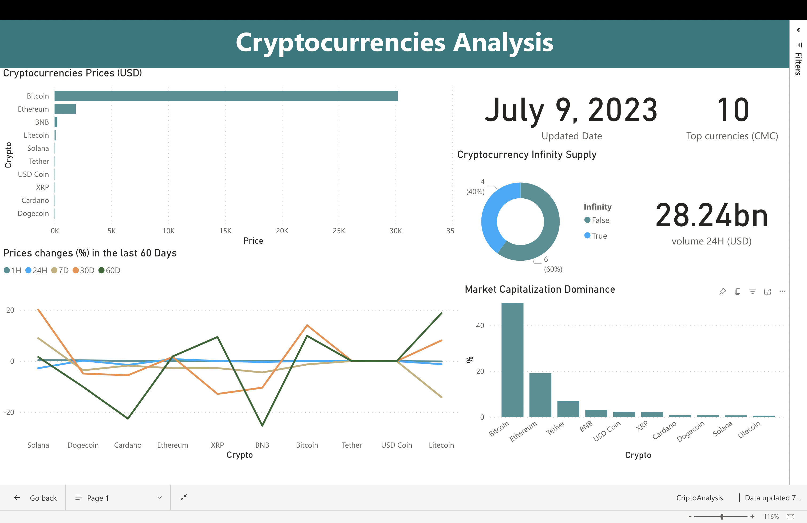

# CryptoCurrency Data Extraction and Visualization

## Description
This project aims to gather data on the top 10 best cryptocurrencies from the Coinmarket API and perform data cleaning and analysis using Python. The cleaned data is then saved as a CSV file, and an email is sent with the CSV file as an attachment to a specified recipient. Finally, a visually appealing dashboard is created using Power BI to provide an intuitive visualization of the extracted cryptocurrency data.

## Objective
The primary objective of this project is to automate the process of extracting cryptocurrency data, performing data cleaning, and visualizing the information through a dynamic dashboard. By leveraging Python's capabilities, we can efficiently retrieve the top 10 cryptocurrencies' data, transform it into a clean and structured format, and generate actionable insights through visualization.

## Features
1. Data Extraction: Utilize the Coinmarket API to fetch real-time data on the top 10 best cryptocurrencies based on market performance.

2. Data Cleaning and Processing: Use the powerful data manipulation capabilities of the Pandas library in Python to clean and preprocess the retrieved data. This step involves removing duplicates, handling missing values, and formatting the data for optimal analysis.

3. CSV Export: Save the cleaned cryptocurrency data as a CSV file. This format allows for easy sharing, compatibility with various software applications, and future analysis.

4. Email Delivery: Send the generated CSV file via email to a specified destination. This feature enables automated data distribution to relevant stakeholders, ensuring timely access to the latest cryptocurrency information.

5. Power BI Dashboard: Leverage Power BI, a robust business intelligence tool, to create an interactive and visually appealing dashboard. The dashboard provides an overview of the top 10 cryptocurrencies, including key metrics, trends, and comparisons. Users can interact with the dashboard to explore specific data points and gain deeper insights.

## Power BI Dashboard

## Conclusion
This project enables you to effortlessly gather, clean, and analyze cryptocurrency data using Python. By generating a CSV file and sending it via email, you can conveniently share the data with relevant stakeholders. Additionally, the Power BI dashboard empowers you to visualize the extracted data in an interactive and visually appealing manner, facilitating quick decision-making and deeper insights into the cryptocurrency market.

## Contributors
- Juan Camilo Marmolejo

